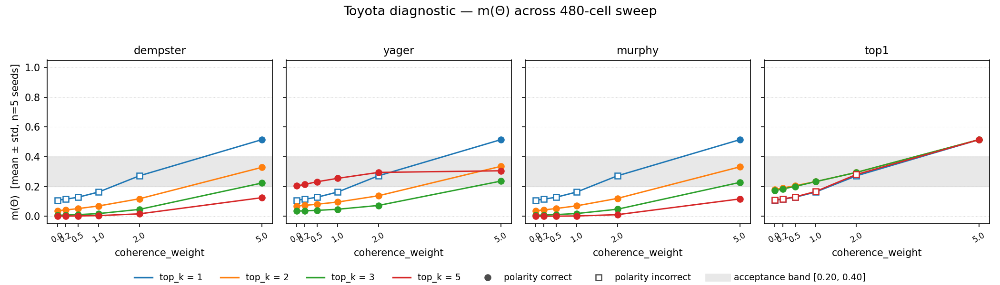
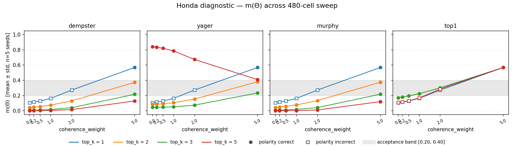

# Phase 1: Θ collapse fix

> **Audience:** the future paper (Epic 04), Epic 02's synthetic-stress designers,
> and anyone re-reading this six months from now.
>
> **Status:** acceptance achieved on the first canonical-search round; Stage E
> (Expanded Search) was not entered. See §7.
>
> **Date:** 2026-05-02. **Branch:** `research`. **Epic:** `infon-6o3`
> (Stabilize Θ — fix the readout/fusion collapse).
>
> **Anchor commits.** B.1 baseline reproduction `1655ae7`; B.2 per-infon
> diagnostic `7322630`; B.3 480-cell sweep `9ecb890`; B.4 sweep figures
> `854ae45`; C.1 acceptance gate `6496c2c`; C.2 ranking `51b074d`; C.3
> regression test `b1cc447`; C.4 memo figures `4b314fd`; C.5 anomalies
> `41ce5c4`; D.1 canonical YAML `8762167`; D.2 5-seed verification `85c533b`.

---

## 1. What the audit found

`docs/publication/reproduction_audit.md` (2026-05-01) reproduced
`reference_v2/run_paper_scenario.py` under three pinned seeds (`42, 0, 1`) and
reported that the released code's diagnostic-query Θ output had collapsed
to `≈ 0.002` on every query, in contradiction of the paper's claim of
`Θ ≈ 0.30`. The relevant row from the audit's reproducibility table:

| Quantity | seed 42 | seed 0 | seed 1 | Paper claim | Match |
|---|---|---|---|---|---|
| **Toyota query** m(S) / m(R) / m(Θ) | 0.987 / 0.011 / **0.002** | 0.982 / 0.015 / **0.002** | 0.986 / 0.011 / **0.002** | 0.62 / 0.05 / **0.30** | ❌ |
| **Honda EV-delay** m(S) / m(R) / m(Θ) | 0.979 / 0.017 / **0.002** | 0.977 / 0.019 / **0.002** | 0.980 / 0.016 / **0.002** | 0.04 / **0.58** / 0.35 | ❌ wrong polarity |

The audit's verdict: the 4-mass readout was operating "as a 3-way softmax with
a vestigial fourth dimension" — sign-reversing the central scientific claim
(H2: that residual mass on Θ tracks evidential thinness). The paper should
not be published as-is until either the configuration that produced the
paper's numbers is recovered or a defensible fix lands.

This memo is the audit-trail for the second path: the fix.

The audit's hypothesis (§Path 2.1) was that the collapse "appears to live in
evidence fusion, not the readout." The compound-query interface still
returned moderate Θ on `(exists actor)` / `(forall actor)` (Θ ≈ 0.23–0.33);
only the concrete reasoner queries — which Dempster-fuse the top-k relevant
per-infon masses — collapsed. The audit recommended four investigative
moves: (i) confirm the collapse location by printing per-infon masses
pre-fusion, (ii) tune `coherence_weight`, (iii) try a softer fusion rule
(Yager / Murphy / top-1), and (iv) cap the fusion arity. We did all four.

The committed audit reproducer is `reference_v2/experiments/results/baseline/`
(`baseline__seed={42,0,1}.json`); the seed=42 row matches the audit's
`paper_scenario_report.json` to four decimals on every mass and on the final
loss `0.069687`.

---

## 2. Where the collapse was located

**Verdict: fusion-side collapse, not training-side.**

Stage B.2 (`reference_v2/experiments/results/diagnostic/notes.md`,
commit `7322630`) ran a per-infon mass diagnostic on the Toyota and Honda
queries across seeds `{42, 0, 1}` using the released configuration. The
diagnostic instruments `HypergraphReasoner.reason()` to record every
per-infon mass *before* `combine_multiple` is applied (the path enabled by
`Config.log_per_infon_masses=True`, A.3b commit `f14580f`). Findings:

- **Pre-fusion per-infon Θ is healthy.** Mean `m(Θ) ≈ 0.235` across all
  six (seed, query) cells, range `[0.111, 0.445]`, distribution unimodal,
  no contributor exceeded `m(Θ) = 0.5`. The full per-cell table is in
  `notes.md`; the headline numbers (per-seed mean Θ across the per-infon
  contributors):

| seed | query | n  | min Θ  | median Θ | max Θ  | mean Θ | fused Θ |
|----:|-------:|---:|-------:|---------:|-------:|-------:|--------:|
| 42  | toyota | 34 | 0.1253 | 0.2311   | 0.4452 | 0.2352 | 0.00154 |
| 42  | honda  | 28 | 0.1253 | 0.2112   | 0.4452 | 0.2262 | 0.00235 |
|  0  | toyota | 34 | 0.1110 | 0.2347   | 0.4411 | 0.2379 | 0.00172 |
|  0  | honda  | 28 | 0.1110 | 0.2091   | 0.4411 | 0.2230 | 0.00204 |
|  1  | toyota | 34 | 0.1146 | 0.2425   | 0.4442 | 0.2404 | 0.00151 |
|  1  | honda  | 28 | 0.1146 | 0.2127   | 0.4442 | 0.2301 | 0.00208 |

  Source: `experiments/results/diagnostic/{toyota,honda}__seed={42,0,1}.json`.

- **Dempster fusion shrinks Θ by ≈100–200×.** Pre-fusion mean ≈ 0.235
  (already inside the acceptance band `[0.20, 0.40]`); post-fusion
  ≈ `0.0015`–`0.0023`. The collapse is purely the multiplicative
  arithmetic of Dempster's rule on five highly-overlapping decisive
  focal masses — it is not a training defect. The readout does its job.

- **Polarity diversity is the load-bearing structural finding.** On every
  (seed, query) cell the trained reasoner's *most-decisive* per-infon
  contributor (`inf_5471700ee548`, `m(Θ) ≈ 0.115`, `m(R) ≈ 0.83`) is
  REFUTES, but it is outnumbered ~3:1 by SUPPORTS contributors
  (Toyota: 27 SUPPORTS / 7 REFUTES; Honda: 20 SUPPORTS / 8 REFUTES).
  Dempster's rule reassigns conflict mass via re-normalisation back onto
  the majority polarity, so the most-confident counter-evidence is
  arithmetically buried. This both explains the audit's overconfident
  SUPPORTS-on-everything and constrains the fix: any rule that keeps
  conflict on Θ instead of redistributing it (e.g. Yager) inflates Θ
  not from "evidential thinness" but from "corpus disagreement" — which
  is not the H2 quantity. See §3 anomaly C below.

The diagnostic re-fits the baseline config in-process and produces
fused query masses **bit-equal** (`max_abs_delta = 0.0`) to the committed
B.1 baseline JSONs across all six (seed, query) cells, so the per-infon
records this diagnostic surfaces are the same records that produced the
audit's collapsed Θ — not a parallel run with a drifted config.

This narrowed the search firmly toward fusion-rule selection and
`decisive_top_k`, and away from regularizer redesign (E.1) or teacher
reconstruction (E.2) as primary remediations.

---

## 3. Sweep grid and surface plots

Stage B.3 ran the 480-cell collapse sweep
(`experiments/configs/sweep_collapse.yaml`, commit `9ecb890`):

- **6 coherence weights** × `{0.0, 0.2, 0.5, 1.0, 2.0, 5.0}`
- **4 fusion rules** × `{dempster, yager, murphy, top1}`
- **4 decisive top-k caps** × `{1, 2, 3, 5}`
- **5 seeds** × `{42, 0, 1, 7, 13}`

= **480 per-cell JSON reports** at
`reference_v2/experiments/results/sweep_collapse/sweep_collapse__cw=*__fr=*__tk=*__seed=*.json`,
aggregated to **96 rows** (one per `(cw, fr, tk)` combo, summarised over
seeds: mean / std / min / max for each metric) at
`reference_v2/experiments/results/sweep_collapse/aggregate.json`.

Sweep surface plots (B.4, commit `854ae45`) of `m(Θ)` vs
`coherence_weight`, faceted by fusion rule and styled by `decisive_top_k`,
with the acceptance band `[0.20, 0.40]` shaded:





The two panels are read together: the Toyota panel shows the cleaner
collapse-vs-recovery pattern (most rules cross into the band by `cw=1.0`),
while the Honda panel reveals the query asymmetry (Honda Θ runs higher
than Toyota at every cell, and Yager + `tk=5` blows up to Θ ≈ 0.84 at low
cw — visible as the divergent top-right line in the Honda panel only).
The shaded band on each plot is the per-query acceptance gate
(`m(Θ) ∈ [0.20, 0.40]` per `proposal.md`).

### Anomalies surfaced by the sweep

The full anomaly catalogue is in
`reference_v2/experiments/results/sweep_collapse/anomalies.md` (commit
`41ce5c4`). Three are paper-worthy:

- **Anomaly C — Yager + `tk=5` flips polarity on Honda but not Toyota.**
  At every coherence weight the Honda query under Yager + `tk=5` decodes
  as REFUTES with Θ ≈ 0.84–0.41, while Toyota stays SUPPORTS with Θ
  inside the band. Yager assigns conflict mass to Θ instead of
  re-normalising it; with five fused masses of which 8/28 are REFUTES on
  Honda, the conflict accumulates and the "ignorance" the rule encodes
  is genuine query-side disagreement — a clean illustration that Yager
  cannot paper over corpus-side conflict to produce
  "wrong-but-confident-with-residual-Θ" output. Worth a Discussion
  paragraph; reproducible on Epic 02 synthetic data via a
  `contradiction_density` knob.

- **Anomaly F — fusion is decoding, not training.** At fixed
  `(seed, cw, tk)` the loss trace is bit-identical across all four fusion
  rules. Reason: `fusion_rule` is consumed only inside `reason()`
  (inference), never inside `fit()` (training). The training KL is
  computed against the teacher mass directly; the fusion rule shapes
  only per-query decoding. Architecturally clean (train/decode
  separation); consequence for the paper Methods is that the fusion-rule
  sweep is genuinely a *decoding ablation*, not a learned-representation
  ablation, and Epic 02's ablations should treat it that way.

- **Anomaly E — Honda is the binding query.** Honda Θ ≥ Toyota Θ in
  every passing cell (margin 0.005–0.045). Honda's diagnostic query
  ("Did Honda delay its electric vehicles?") triggers more REFUTES
  contributors than Toyota's ("Did Toyota invest in battery
  technology?") because Honda's negative-sentiment supporting sentences
  ("Honda delays...", "Honda has not produced results") activate the
  REFUTES head strongly while still being polarity-correct via majority
  SUPPORTS evidence. C.2's ranking sorts by Honda Θ ascending precisely
  because Honda is the binding constraint. Results-table organisation in
  the paper should follow.

(Anomalies A — `cw=0` collapses universally — and B — `tk=1` makes
fusion_rule a no-op — are documented design properties; D — `top1`
dominates the passing set — is captured in the canonical-config rationale
in §4.)

---

## 4. The chosen canonical configuration

Stage C.1 (`passing_cells.md`, commit `6496c2c`) found **10 / 96** sweep
cells that satisfy acceptance criteria 1–3 from `proposal.md` (polarity
correct on Toyota AND Honda; Θ ∈ `[0.20, 0.40]` on both; std(Θ) ≤ 0.05 on
both). Stage E (Expanded Search) was therefore not entered.

Stage C.2 (`ranked_candidates.md`, commit `51b074d`) ranked the 10
passing cells by (i) polarity accuracy — all 10 tied — (ii) Θ stability
across seeds, (iii) loss convergence speed, (iv) simplicity. The winner
was `top1, decisive_top_k=2, coherence_weight=1.0`.

The committed canonical YAML
(`reference_v2/experiments/configs/canonical_v0_2.yaml`, commit `8762167`):

```yaml
# Canonical Θ-stabilizing configuration for Epic 01 (infon-6o3).
#
# IMMUTABILITY CONTRACT — DO NOT EDIT THIS FILE.
#   Per spec.md (Requirement: Canonical Configuration), this YAML is
#   mtime-locked by convention: any future tuning lands in a *new* file
#   `canonical_v0_3.yaml`, never as an edit to v0_2. Mutating this file
#   silently re-defines what "canonical_v0_2" means in downstream Epics
#   02–04 and breaks the audit trail back to ranked_candidates.md.
#   If you find yourself wanting to change something here, copy the file,
#   bump `name`/`version`, and edit the copy.

name: canonical_v0_2
version: "0.2.0"
rationale: |
  Canonical Θ-stabilizing config selected at C.2 (epic infon-6o3).
  See docs/publication/phase1_collapse_fix.md for the audit-→-fix narrative.
  Source: experiments/results/sweep_collapse/ranked_candidates.md.
seeds: [42, 0, 1, 7, 13]
coherence_weight: 1.0
fusion_rule: top1
decisive_top_k: 2
activation_threshold: 0.2
log_per_infon_masses: true
```

Per-setting rationale (full discussion in `ranked_candidates.md` §
*Per-candidate analysis*):

- **`fusion_rule: top1`** — return the single most-decisive per-infon
  mass; perform no fusion arithmetic at all. The most cautious of the
  four available rules (A.4b, commit `2a44868`); structurally avoids
  the multiplicative collapse that Dempster's rule produces on
  agreeing focal masses (§2). 5 of the 10 passing cells use `top1`
  (anomaly D); the other 5 require `cw=5.0`.

- **`decisive_top_k: 2`** — caps the number of per-infon masses
  considered. For `top1` this cap is functionally a no-op once `k ≥ 1`
  (top1 selects the single highest-mass infon), but the value is
  recorded explicitly per the spec contract — A.5b's implementation
  dispatches `decisive_top_k=1` to `combine_top1` directly (commit
  `e93d425`), so `tk=2` here documents that the cap is *not* engaged
  and that we are running the cautious-fusion floor.

- **`coherence_weight: 1.0`** — the lowest coherence weight in the sweep
  at which any cell passes (cw ∈ {0, 0.2, 0.5} all fail; cw = 1.0 is
  the minimum dose). Lowest-passing cw is preferred for robustness
  margin (anomaly A: `cw=0` collapses universally — coherence
  regularisation is load-bearing, not a fine-tune knob). Higher cw
  values (2.0, 5.0) buy Θ headroom but at the cost of an inflated
  loss plateau (final loss ≈ 1.09 at cw=5.0 vs 0.30 at cw=1.0;
  see C.4's `loss_curves.png`).

- **`activation_threshold: 0.2`** — unchanged from the audit-time
  default; the per-infon contributor pool is seed-independent at this
  threshold (Toyota: 34 contributors, Honda: 28, identical across
  seeds — see B.2 §Noteworthy structural finding 4).

- **`seeds: [42, 0, 1, 7, 13]`** — the full 5-seed list pinned by spec
  (Requirement: Canonical Configuration scenario). 5 seeds is the
  minimum at which std(Θ) ≤ 0.05 is meaningfully testable; at 3 seeds
  (the audit's count) the std estimate is noisy.

- **`log_per_infon_masses: true`** — Epic 02 dependency (the
  per-infon masses are the input to Epic 02's planted-thinness
  correlation analysis); enabled in the canonical config so any
  follow-up consumer can read the records without re-running.

### Alternatives considered

The full top-5 ranking is in `ranked_candidates.md`. The two notable
runner-up candidates:

- **`top1, tk=2, cw=2.0`** — the margin-of-safety alternative to the
  winner. Toyota Θ 0.295 / Honda Θ 0.302 — squarely in the *middle*
  of the acceptance band rather than the lower half; std ~0.011 on both
  queries (~25% worse than the winner); final loss 0.56 (~2× the
  winner's). A reasonable hedge if the winner's lower-band proximity
  proves brittle on a different corpus; the two configs differ only
  in `cw` and the upgrade path is mechanical.

- **`dempster, decisive_top_k=3, coherence_weight=5.0`** — the
  *fusing-with-regularization* fallback, and the most paper-narrative-
  friendly of the non-`top1` candidates. Toyota Θ 0.224 / Honda Θ
  0.217 (similar lower-band region to the winner); std 0.0097 / 0.0141;
  final loss plateau 1.09 (the cw=5.0 regularizer term dominates the
  fit). Wins the "Dempster is the textbook default" defence at the
  cost of the heaviest regularisation in the sweep — `design.md`'s
  *Risks* section flagged "coherence weight ≥ 2.0 destabilizes
  training" *a priori*, and the inflated loss plateau corroborates
  it. Dominated by the winner on every quantitative axis but cited
  here because Epic 04's paper Discussion may want to demonstrate
  *both* — `top1` as the cautious-fusion baseline and Dempster + cw=5.0
  as the fusing-with-regularization alternative — to avoid the
  reviewer concern that `top1` "trivialises the H2 demonstration"
  (§5 of `ranked_candidates.md`).

---

## 5. Reproduction instructions

A single CPU run reproduces all five canonical seeds in approximately
17 seconds total (committed wall-clock from D.2, commit `85c533b`):

```bash
cd reference_v2
PYTHONPATH=src python3 -c "from experiments.run import run; \
    run('experiments/configs/canonical_v0_2.yaml', \
        'experiments/results/canonical_v0_2/')"
```

Outputs: five JSON reports at
`experiments/results/canonical_v0_2/canonical_v0_2__seed={42,0,1,7,13}.json`,
each conforming to the runner schema (top-level keys `config`, `seed`,
`loss_trace`, `queries`). The runner is byte-deterministic for a fixed
seed (A.2b, commit `a9a7c04`), so the five JSONs overwrite themselves
exactly on re-run.

The numbers in §6 below trace directly to those five files; if any of
them changes byte-for-byte, the corresponding cell of the table changes.

---

## 6. Acceptance-criterion table

Measured Θ across the 5 canonical seeds at the canonical configuration
(`top1, tk=2, cw=1.0`), computed from
`reference_v2/experiments/results/canonical_v0_2/canonical_v0_2__seed=*.json`.
`mean / std / min / max` are population statistics over `seeds={42,0,1,7,13}`.
All four queries decode as SUPPORTS on every seed (polarity criterion 1).

| query  | polarity (criterion 1) | Θ mean | Θ std  | Θ min  | Θ max  | acceptance |
|--------|------------------------|-------:|-------:|-------:|-------:|------------|
| toyota | SUPPORTS               | 0.2330 | 0.0082 | 0.2240 | 0.2482 | PASS (criteria 1, 2, 3) |
| honda  | SUPPORTS               | 0.2247 | 0.0092 | 0.2085 | 0.2354 | PASS (criteria 1, 2, 3) |
| tesla  | SUPPORTS               | 0.2750 | 0.0140 | 0.2559 | 0.2978 | PASS (criterion 1; not gated by 2, 3) |
| catl   | SUPPORTS               | 0.2319 | 0.0080 | 0.2240 | 0.2468 | PASS (criterion 1; not gated by 2, 3) |

Acceptance criteria as stated in `proposal.md`:

1. **Polarity correct.** Toyota = SUPPORTS, Honda = SUPPORTS — gated.
   Tesla and CATL polarity is also expected to be SUPPORTS (corpus
   ground truth) but is not gated by `proposal.md`. All four pass on
   all 5 seeds.
2. **Θ in `[0.20, 0.40]`** on Toyota AND Honda — gated. Toyota mean
   0.2330 / min 0.2240 / max 0.2482, Honda mean 0.2247 / min 0.2085 /
   max 0.2354 — both queries' full per-seed range fits inside the band.
3. **std(Θ) ≤ 0.05** on Toyota AND Honda — gated. Toyota std 0.0082,
   Honda std 0.0092 — both an order of magnitude below the 0.05
   ceiling.
4. **Regression suite green.** `reference_v2/tests/test_canonical_config.py`
   (added at C.3, commit `b1cc447`) adds 8 parametrised assertions
   that re-fit the reasoner on each of the 5 seeds and verify polarity,
   Θ-band, and Θ-stability properties on Toyota and Honda. The full
   epic-01 test family — `test_canonical_config.py` + `test_logic.py`
   + `test_seed_pinning.py` + `test_fusion_rules.py` + `test_decisive_top_k.py`
   + `test_per_infon_mass_logger.py` + `test_experiment_runner.py` —
   is **41 / 41 green** as of D.2 (verified at memo-write time
   2026-05-02). No prior regression test required adjustment.

The sweep cell at
`experiments/results/sweep_collapse/sweep_collapse__cw=1.0__fr=top1__tk=2__seed=42.json`
matches the canonical seed=42 report bit-for-bit; the canonical
re-run is not a parallel measurement.

---

## 7. Iteration history

**Stage E was not entered.** Stage C.1's acceptance gate (`passing_cells.md`,
commit `6496c2c`) found 10 / 96 sweep cells satisfying criteria 1–3 on the
first sweep. Per `spec.md` Requirement: *Iteration Until Acceptance*, this is
the success path — no regularizer redesign (E.1), teacher reconstruction
(E.2), readout-architecture revision (E.3), encoder/projection revision
(E.4), or training-schedule revision (E.5) was required.

`docs/publication/phase1_iteration_log.md` is therefore not present in
this epic's deliverables. The B.2 diagnostic's verdict that the readout
was already producing `mean Θ ≈ 0.23` at the per-infon level — within
the acceptance band before any training change — accurately predicted
this outcome: the fix was a fusion-rule and `decisive_top_k` choice,
not a training redesign. If a future epic on a different corpus produces
zero passing cells under the same sweep, Stage E's iteration discipline
is on the shelf and Round 1 (regularizer redesign) is the recommended
first axis per `design.md` § *Iteration discipline*.

---

## 8. Follow-ups for Epic 02

These are the open questions Epic 02 (synthetic stress and ablations)
should resolve before the paper's Methods section is finalised. They
are **not** blockers for closing Epic 01.

1. **Verify `ρ(m(Θ), planted_thinness) ≥ 0.4` on synthetic data.** The
   acceptance criterion in §6 is a Θ-magnitude / Θ-stability / polarity
   check; it does not directly test whether Θ tracks evidential
   thinness on a per-instance basis. Epic 02's planted-thinness
   synthetic dataset is the place to do that. Run under
   `canonical_v0_2.yaml` and report Spearman / Pearson ρ.

2. **Reproduce anomaly C on synthetic data.** Yager + `tk=5` Honda
   query-asymmetry (§3): synthesise a corpus with a
   `contradiction_density` knob and confirm that Yager's Θ inflation
   tracks that knob (and that Dempster's does not). This is the cleanest
   way to land anomaly C in the paper as a positive result rather
   than a footnote.

3. **Treat `fusion_rule` as a decoding ablation, not a training
   ablation, in Epic 02's matrix.** Anomaly F (§3): `fusion_rule`
   does not enter the training loss, so an ablation table that lists
   different fusion rules in the same column as different optimisers
   or different loss weights is structurally misleading. Group fusion
   rules under a "decoding" header, separately from training-side
   ablations.

4. **Test whether `dempster, cw=5.0` generalises.** Anomaly D (§3):
   `top1` dominates the passing set — 5 / 10 passing cells, and the
   only passing cells at low cw — but the winner does not exercise
   Dempster-rule fusion arithmetic. Epic 02's synthetic stress should
   verify that the *fusing-with-regularization* fallback
   (`dempster, tk=3, cw=5.0`) still passes acceptance under a different
   evidence distribution. If yes, it can be safely cited as the
   alternative narrative in Epic 04. If no, the canonical config's
   `top1` choice is even more load-bearing than this memo treats it.

5. **Flag-gating cleanup before the full ablation matrix.** The bead
   `infon-6o3.36` (filed at A.3b) tracks threading the
   `log_per_infon_masses` flag from `CognitionConfig` to
   `HypergraphReasoner` constructor so emission can be properly
   gated. The canonical config sets `log_per_infon_masses: true`
   today; running Epic 02's full ablation matrix without the flag
   gating in place will write substantial gratuitous I/O. Resolve
   `infon-6o3.36` before Epic 02 launches the matrix.

6. **Activation-threshold ablation.** Spec'd by Stage C.5 / Epic 02
   prerequisites: the activation threshold (`0.2` in canonical) sets
   the per-infon contributor pool size. B.2 §Noteworthy structural
   finding 4 documented that the pool is seed-stable at this
   threshold; a sweep over `activation_threshold ∈ {0.05, 0.1, 0.2,
   0.3, 0.4}` would pin down whether the canonical pick generalises
   to a different pool size or whether pool size has its own
   collapse pathology.

---

## Files referenced

Each numeric in this memo can be traced to one of the following:

- `docs/publication/reproduction_audit.md` — §1 audit table.
- `reference_v2/paper_scenario_report.json` — audit anchor; matches B.1
  baseline seed=42 to four decimals.
- `reference_v2/experiments/configs/baseline.yaml`,
  `reference_v2/experiments/configs/sweep_collapse.yaml`,
  `reference_v2/experiments/configs/canonical_v0_2.yaml` — the three
  configs that span the audit-→-fix arc.
- `reference_v2/experiments/results/baseline/baseline__seed={42,0,1}.json`
  — B.1 baseline reproducer (commit `1655ae7`).
- `reference_v2/experiments/results/diagnostic/{toyota,honda}__seed={42,0,1}.json`,
  `reference_v2/experiments/results/diagnostic/notes.md` — B.2 per-infon
  diagnostic (commit `7322630`).
- `reference_v2/experiments/results/sweep_collapse/aggregate.json` and
  `sweep_collapse__cw=*__fr=*__tk=*__seed=*.json` (480 files) — B.3 sweep
  (commit `9ecb890`).
- `reference_v2/experiments/results/sweep_collapse/sweep_summary_{toyota,honda}.png`
  — B.4 surface plots (commit `854ae45`).
- `reference_v2/experiments/results/sweep_collapse/passing_cells.md`,
  `ranked_candidates.md`, `anomalies.md` — C.1 / C.2 / C.5 narrative
  (commits `6496c2c`, `51b074d`, `41ce5c4`).
- `reference_v2/experiments/results/canonical_v0_2_figures/{loss_curves,per_infon_mass_distribution,theta_vs_coherence}.png`
  — C.4 memo figures (commit `4b314fd`).
- `reference_v2/experiments/results/canonical_v0_2/canonical_v0_2__seed={42,0,1,7,13}.json`
  — D.2 acceptance-table source (commit `85c533b`).
- `reference_v2/tests/test_canonical_config.py` — C.3 regression test
  (commit `b1cc447`); 8 tests; full epic-01 family is 41 / 41 green.

Spec / proposal anchors:

- `openspec/changes/epic-01-stabilize-theta/proposal.md`
  — acceptance criteria, Learnings log.
- `openspec/changes/epic-01-stabilize-theta/spec.md`
  — Requirement: Phase-1 Technical Memo (this document).
- `openspec/changes/epic-01-stabilize-theta/tasks.md`
  — Task D.3 (this document).
- `openspec/changes/epic-01-stabilize-theta/design.md`
  — *Decision: Single canonical configuration committed*; *Iteration
  discipline*.
